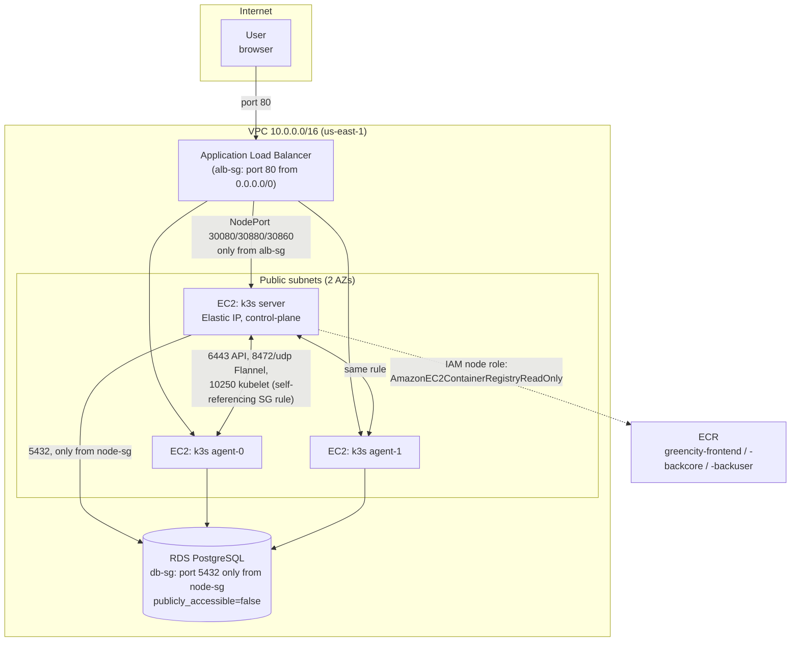
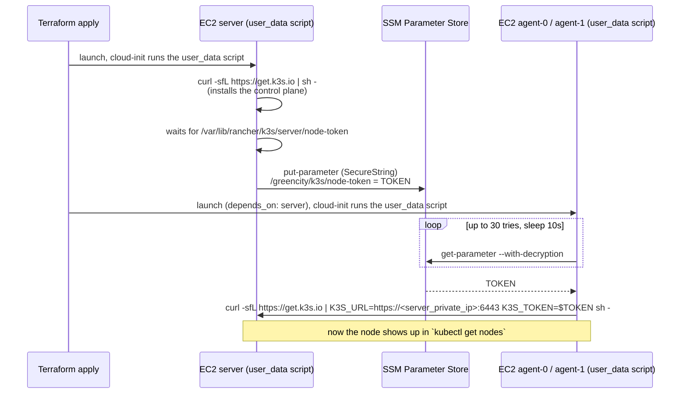
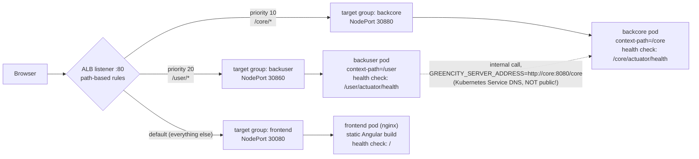
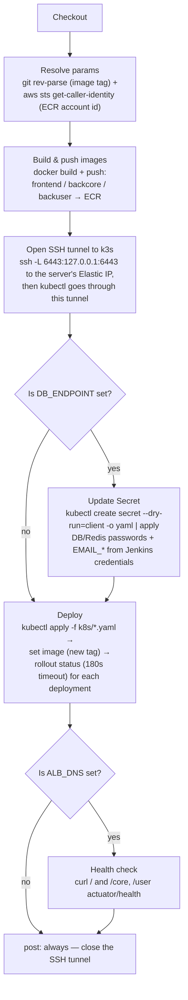
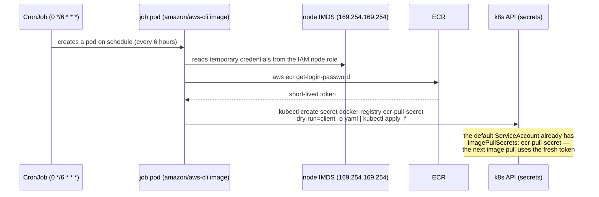
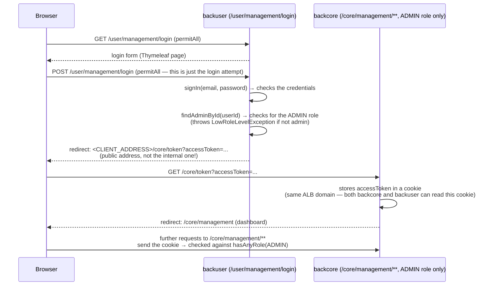

# GreenCity — AWS ("cloud") deployment

This README explains the `cloud` track — a second deployment of the GreenCity app (`frontend` + `backcore` + `backuser`) on AWS. I run it on our own Kubernetes cluster (`k3s`) on EC2 instances. It has its own Jenkins CI/CD pipeline.

This track is fully separate from the old Proxmox on-prem deployment. They do not share any state or files (except the app source code). They have different Jenkinsfiles and different credentials.

---

## 1. What is in this repository

```
cloud--GreenCity_Full/
├── apps/                  # the same app source code (frontend, backcore, backuser)
├── infra/                 # Terraform: VPC, EC2 (k3s), ALB, RDS, ECR, IAM, Security Groups
├── k8s/                   # Kubernetes files (Deployment/Service for each app + Redis + RBAC + CronJob)
└── Jenkinsfile             # CI/CD pipeline for this track
```

---

## 2. Infrastructure architecture

We use one VPC with 2 public subnets (2 availability zones). There are no private subnets and no NAT gateway — we kept it simple for a demo project. 3 EC2 instances form one `k3s` cluster (1 server node + 2 agent nodes). An Application Load Balancer sits in front of them and routes traffic by path. There is also an RDS Postgres database (used by both `backcore` and `backuser`) and a Redis instance (running inside the cluster, not a managed AWS service).



**Security Groups** (`infra/security_groups.tf`):

| SG | Allowed inbound traffic |
|---|---|
| `alb-sg` | port `80` from `0.0.0.0/0` (anyone) |
| `node-sg` | port `22` (SSH, only from the admin's IP), ports `30080`/`30880`/`30860` (NodePorts, only from `alb-sg`), ports `6443`/`8472/udp`/`10250` (self-referencing rule — traffic between the cluster's own nodes) |
| `db-sg` | port `5432`, only from `node-sg` |

The RDS database has `publicly_accessible = false`. This means we can only reach it from a node inside the cluster — for example with `psql` run directly on a node, or through an SSH tunnel.

### How the cluster starts (no managed control plane, this is not EKS)

This is plain `k3s` on normal EC2 instances, not EKS. So the nodes need a simple way to join each other. We use AWS SSM Parameter Store for this:



All 3 instances share one IAM role (`${project_name}-node-role`). This role can read/write that one SSM parameter, and it also has `AmazonEC2ContainerRegistryReadOnly`. Note: this ECR permission does **not** pull images automatically — plain `k3s` (unlike EKS) has no built-in ECR credential provider. But this same permission is what the CronJob in section 5 uses to refresh the image pull token.

---

## 3. Request routing (ALB path-based rules)

All three services share one domain (the ALB DNS name). The ALB does **not** rewrite the request path — this was an important detail and a source of real bugs early on. So each Spring Boot app has its own `server.servlet.context-path`, matching the ALB path prefix.



Each Deployment uses a `NodePort` Service (not `ClusterIP`), because the ALB (target type `instance`) sends traffic straight to a port on the node. `kube-proxy` then forwards it to the right pod, even if that pod is not running on that exact node.

**Important**: `GREENCITY_SERVER_ADDRESS` (internal address `http://core:8080/core`, a Kubernetes Service DNS name) and `CLIENT_ADDRESS` (public address `http://<ALB>`) are two different variables on purpose, for two different audiences: the first one is for server-to-server calls from `backuser` to `backcore` (`RestClient.java`); the second one is for anything that goes to the user's browser (links in emails, redirects). Mixing up these two addresses caused at least two real bugs during this deployment (the email verification link, and the redirect after admin login — see section 6).

The Angular frontend does not have real URLs baked into `environment.prod.ts` at build time. Instead, placeholders like `${BACKEND_LINK}` get replaced by `envsubst` when the container starts, using environment variables from `k8s/frontend.yaml` (`BACKEND_LINK`, `BACKEND_USER_LINK`, `FRONTEND_LINK`). Some variables (chat/sockets/Firebase/maps) are set to `"unused"` on purpose — these features are not connected in this demo deployment. Console errors coming from these placeholders are expected and do not need fixing.

---

## 4. CI/CD (Jenkins)

One `Jenkinsfile`, separate from the Proxmox pipeline. It takes parameters (`SERVER_IP` / `ALB_DNS` / `DB_ENDPOINT`) from `terraform output`, entered by hand when starting a build.



The `jenkins-deployer` RBAC setup (`k8s/rbac-jenkins.yaml`) uses its own `ServiceAccount` plus a namespace-scoped `Role`/`RoleBinding`. We gave it the smallest set of permissions possible, and we added each one step by step, only when a real `Forbidden` error showed it was missing (`deployments`, `services`, read access to `pods`, read/write access to `secrets`). It does **not** have permission to manage `namespaces` — that is a cluster-scoped resource, and a namespace-scoped `Role` simply cannot grant access to it.

---

## 5. ECR login and refreshing the pull token

Plain `k3s` (unlike EKS) has no built-in ECR credential provider. The docker login token only lasts 12 hours. Without automation, pods would fail with `ImagePullBackOff` every 12 hours.

The fix is a `CronJob` (`k8s/ecr-refresh-cronjob.yaml`), not a kubelet plugin. We tried the kubelet-plugin approach first (`ecr-credential-provider`), but it did not work: `kubernetes/cloud-provider-aws` does not publish any ready-to-use binary for this plugin in its releases.



This has its own `ServiceAccount`/`Role`/`RoleBinding` with only `get/create/update/patch` rights on `secrets` in the `greencity` namespace — the smallest possible permission for this one job.

---

## 6. Real bugs found and fixed through this deployment

These problems did not show up (or did not matter) on Proxmox. The ALB (no path rewriting) and the public domain brought them to the surface.

1. **Datasource env-var naming** — at first, the k8s files only set `SPRING_DATASOURCE_*` variables, but the shared `application-docker.properties` file (a Proxmox file, which this track does not touch) expects plain `DATASOURCE_URL`/`USER`/`PASSWORD` names. Liquibase and Hibernate crashed on startup. Fix: added explicit `env:` entries in the k8s files, without changing the shared properties file.
2. **Probe timing** — the default `readinessProbe`/`livenessProbe` killed the JVM while it was still starting up (RDS + a 443-changeset Liquibase migration + a multi-module Spring Boot app take longer than the default `initialDelaySeconds`). Fix: switched to a `startupProbe`.
3. **The ALB does not rewrite the path** — `backcore` and `backuser` had no `server.servlet.context-path`, so requests to `/core/*`/`/user/*` from the ALB simply did not match any route. Fix: added `SERVER_SERVLET_CONTEXT_PATH=/core` and `/user`, and updated the health check paths too.
4. **Missing `envsubst` step in the frontend build for this AWS fork** — placeholders like `${BACKEND_LINK}` were compiled straight into the production JS bundle, with no substitution step to replace them with real values.
5. **`client.address` vs `address` in `EmailServiceImpl`** — the email verification / password reset link (`client.address`) needs to point to the public ALB domain, not to `localhost` or an internal address. A separate property called `address` only affects the newsletter unsubscribe link — easy to confuse the two.
6. **The 12-hour ECR token** — see section 5.
7. **`.rememberMe()` instead of `.permitAll()` on `POST /management/login`** (`backuser/SecurityConfig.java`) — this authorization rule required an already-logged-in remember-me session, which does not exist in this stateless, JWT-based app. So the admin login form rejected **every** login attempt with a 401 error, before the request even reached the controller code. Fix: changed it to `.permitAll()`, the same as `GET /management/login` already had.
8. **Internal URL used in the redirect after admin login** — after fixing bug 7, a second, previously hidden bug appeared: `ManagementSecurityController` built its redirect using `greencity.server.address` (`http://core:8080/core` — an internal Kubernetes Service DNS name, not reachable from a browser) instead of the public address. This is the same kind of mistake as bug 5 — one property was serving two different audiences: internal server calls (`RestClient`) and a browser redirect. Fix: added a separate field for `client.address`, used only for this redirect, and left `greencity.server.address` unchanged for `RestClient`.

**A pattern worth remembering for future work on this code**: whenever a config has "one address for everything", ask first — who actually reads this value? A server (needs an internal DNS address) or the user's browser (needs the public ALB domain)? This exact question was the root cause of two bugs already.

---

## 7. The admin panel (`/management/...`) — a separate server-rendered console

This is an important, not-so-obvious fact about the architecture: the admin panel (news, habits, tags, facts, shopping lists, rating stats, users) is **not part of the Angular app** (it has zero admin components). Instead, it is a set of server-rendered Thymeleaf pages, served directly by `backcore` itself (`greencity.webcontroller.Management*Controller`, in the `webcontroller` package, not the normal REST `controller` package). The login for it is a separate form on `backuser`.



The user's role lives in `users.role` (in RDS, stored as text: `ROLE_USER`/`ROLE_ADMIN`/`ROLE_MODERATOR`/`ROLE_EMPLOYEE`/`ROLE_UBS_EMPLOYEE`). There is no self-service way to become an admin — you make someone an admin with a direct SQL command: `UPDATE users SET role='ROLE_ADMIN' WHERE email=...`.

---

## 8. Key commands for working with this track

```bash
# infrastructure
cd infra
terraform init
terraform apply

# values needed for the Jenkins build parameters
terraform output -raw k3s_server_public_ip
terraform output -raw alb_dns_name
terraform output -raw db_endpoint

# access the cluster from the server node (SSH)
ssh -i <key> ec2-user@<k3s_server_public_ip>
sudo k3s kubectl -n greencity get pods

# access RDS (only possible from a cluster node — no public access)
psql -h <db_endpoint host> -U greencity_admin -d greencity
```

---

## 9. Things left out of this demo on purpose

The value `"unused"` in `k8s/frontend.yaml` (chat/WebSocket, Firebase, Google Maps API, the UBS admin panel) does not mean a bug — these features are simply switched off on purpose, outside the scope of this deployment. The related browser console errors (`unused/...` URLs, a broken WebSocket connection) are expected. They do not need to be fixed unless we decide to turn on these features later.
